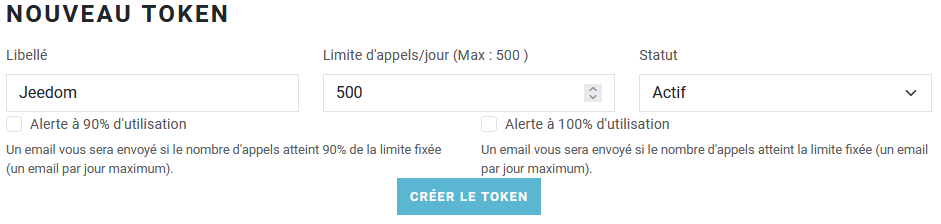

# Plugin MeteoMC - BETA

## Description

The **MeteoMC** plugin can be used to retrieve weather forecasts for one (or more) town(s). It can be displayed over 5 days and by period.

## Prerequisites

- You need a [MétéoConcept](https://api.meteo-concept.com) account, which is free for up to 500 calls per day.

## Installation 

- Download the plugin from the market
- Activate the plugin

# MétéoConcept account

- Rendez-vous sur le site [MétéoConcept](https://api.meteo-concept.com/register/)
- Create an account if you do not already have one.
- Once you have logged into your account, click on "Mes abonnements".
- Choose a free "Basique" subscription.
- Create a token for the plugin.

# Configuration parameters :

- **Meteo Concept API Key** : Token obtained during the previous step on the MétéoConcept website.

# Equipment

The equipment can be accessed from the Plugins → Weather menu.

## Creating equipment

Each piece of equipment will represent a city. Simply click on "Add".

## Equipment configuration

Here you will find all the settings for your equipment:

- **Equipment name**: name of your equipment.
- **Parent object**: indicates the parent object to which the equipment belongs.
- **Activate**: makes your equipment active.
- **Visible**: makes your equipment visible on the dashboard.

Below you will find the specific parameters for your equipment:

- **City**: Enter the city whose weather you want here.
- **Other Settings**: Customise the way the widget is displayed.

# Plugin widget

## Desktop version

## Mobile version

