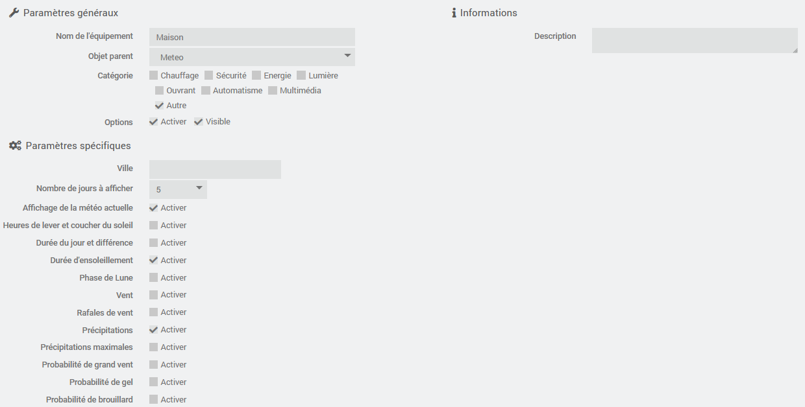
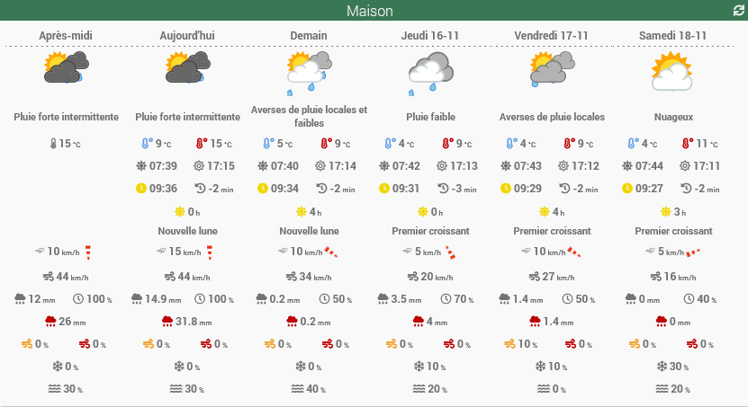

# Plugin MeteoMC

## Description

Le plugin **MeteoMC** permet de récupérer les prévisions météorologiques d'une (ou plusieurs) villes(s). Il permet l'affichage sur 5 jours et par périodes.

## Pré-Requis

- Vous devez disposer d'un compte [MétéoConcept](https://api.meteo-concept.com), gratuit jusqu'à 500 appels par jour.

## Installation 

- Télécharger le plugin depuis le market
- Activer le plugin

# Compte MétéoConcept

- Rendez-vous sur le site [MétéoConcept](https://api.meteo-concept.com/register/)
- Créer un compte si vous n'en avez pas déjà un. N'oubliez pas d'activer le compte en cliquant sur le lien reçu dans un mail.
- Une fois connecté à [votre compte](https://api.meteo-concept.com/profile/), cliquez sur "Mes abonnements"
- Choisir un abonnement "Basique" gratuit.

- Vous êtes redirigé vers la page de configuration de votre abonnement. Cliquez sur "Afficher les Tokens".

- Ajoutez maintenant un token en cliquant sur "Ajouter un Token"

- Configurer votre nouveau token comme ci-dessous.

- Votre token est maintenant disponible en cliquant sur "Afficher"

# Paramètres de configuration :

- **Clef API Meteo Concept** : Token obtenu lors de l'étape précédente sur le site de MétéoConcept.

# Equipements

Les équipements sont accessibles à partir du menu Plugins → Météo.

## Création d'un équipement

Chaque équipement représentera une Ville. Il vous suffit de cliquer sur "Ajouter".

## Configuration d'un équipement

Vous retrouvez ici toute la configuration de votre équipement :

- **Nom de l’équipement** : nom de votre équipement.
- **Objet parent** : indique l’objet parent auquel appartient l’équipement.
- **Activer** : permet de rendre votre équipement actif.
- **Visible** : rend votre équipement visible sur le dashboard.

En dessous vous retrouvez les paramètres spécifiques de votre équipement:

- **Ville** : Saisir ici la ville dont vous voulez la météo.
- **Autres Paramètres** : Personnalisation de l'affichage du widget.

# Widget du plugin

## Version Desktop

En cliquant sur la date voulue, vous obtenez le détail de la journée en 4 périodes.

## Version Mobile

